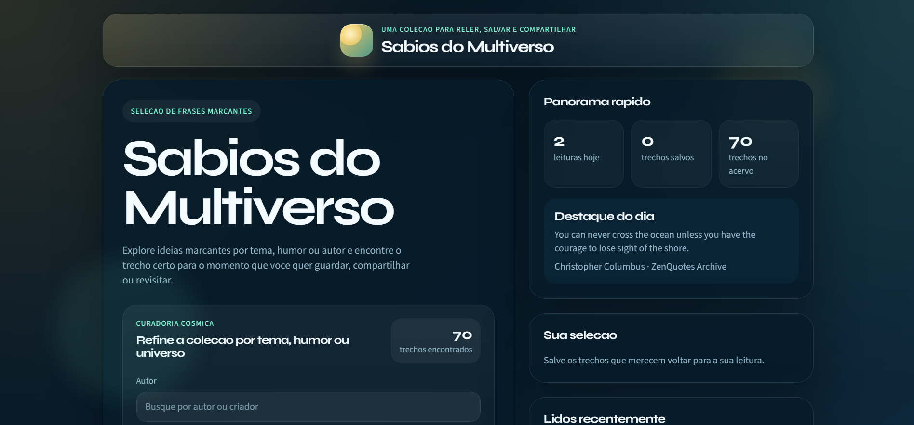
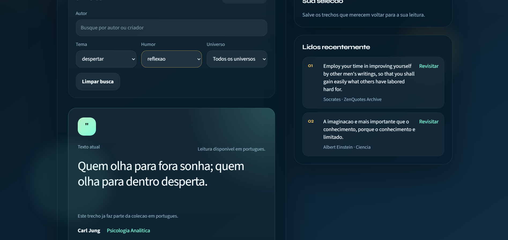

# Sabios do Multiverso

Aplicacao front-end em `React + Vite` focada em curadoria de frases, exploracao por filtros e uma interface visual com identidade propria.

---

## PT-BR

### Visao geral

Sabios do Multiverso e um projeto de portfolio pensado como um pequeno produto digital: uma colecao de frases marcantes com filtros por `autor`, `tema`, `humor` e `universo`, alem de recursos de favoritos, historico, compartilhamento social e exportacao de cards.

O objetivo do projeto foi sair de uma base simples e transformar a experiencia em algo mais refinado, com:

- interface mais autoral;
- estado organizado em componentes React;
- interacoes mais claras para leitura e descoberta;
- estrutura preparada para deploy no `Vercel`.

### Destaques do projeto

- Curadoria de frases com exploracao por filtros.
- Busca por autor.
- Historico de leitura recente.
- Favoritos salvos localmente.
- Compartilhamento para `WhatsApp`, `Instagram` e `X`.
- Geracao de card para postagem.
- Variacao visual por humor.
- Base local com ampliacao via fonte remota de quotes.

### Stack

- `React`
- `Vite`
- `CSS` puro
- `localStorage`
- `Vercel Functions` para rotas de apoio

### O que este projeto demonstra

- Estruturacao de interface em componentes reutilizaveis.
- Organizacao de estado em uma aplicacao pequena, mas com varias interacoes.
- Cuidado com identidade visual e consistencia de experiencia.
- Adaptacao de uma ideia simples para um formato mais forte de portfolio.
- Preparacao para deploy e integracao com APIs externas.

### Screenshots





### Estrutura principal

```text
sabios-do-multiverso/
|- api/
|  |- quotes.js
|  `- translate.js
|- public/
|- src/
|  |- components/
|  |- data/
|  |- hooks/
|  |- services/
|  |- App.jsx
|  |- main.jsx
|  `- styles.css
|- index.html
|- package.json
|- vite.config.js
`- README.md
```

### Como rodar localmente

```bash
npm install
npm run dev
```

### Build

```bash
npm run build
```

### Deploy

O caminho recomendado para producao e o `Vercel`, porque o projeto usa rotas em `api/` para apoiar o carregamento remoto de frases e a traducao sob demanda.

### Possiveis proximos passos

- finalizar e validar o fluxo de traducao em producao;
- adicionar screenshots reais no README;
- incluir testes de interface;
- refinar ainda mais os estados mobile;
- criar uma pagina de apresentacao do projeto no portfolio principal.

---

## English

### Overview

Sabios do Multiverso is a `React + Vite` front-end portfolio project designed as a small digital product: a curated quote experience with filtering, favorites, reading history, social sharing and visual card export.

The project started from a simpler base and was redesigned to feel more intentional, polished and portfolio-ready, with:

- stronger visual identity;
- clearer component-based structure;
- more thoughtful interaction design;
- deployment-ready architecture for `Vercel`.

### Project highlights

- Quote exploration with multiple filters.
- Author search.
- Recently viewed history.
- Locally saved favorites.
- Social sharing for `WhatsApp`, `Instagram` and `X`.
- Card export for posts and stories.
- Mood-based visual accents.
- Local collection extended through remote quote loading.

### Stack

- `React`
- `Vite`
- Plain `CSS`
- `localStorage`
- `Vercel Functions`

### What this project showcases

- Reusable component-based UI structure.
- State handling for a small app with multiple user interactions.
- Strong attention to visual identity and UX consistency.
- Ability to turn a simple idea into a more product-oriented portfolio piece.
- Deployment preparation and external API integration.

### Screenshots


### Main structure

```text
sabios-do-multiverso/
|- api/
|  |- quotes.js
|  `- translate.js
|- public/
|- src/
|  |- components/
|  |- data/
|  |- hooks/
|  |- services/
|  |- App.jsx
|  |- main.jsx
|  `- styles.css
|- index.html
|- package.json
|- vite.config.js
`- README.md
```

### Run locally

```bash
npm install
npm run dev
```

### Build

```bash
npm run build
```

### Deployment

`Vercel` is the recommended production target because the project relies on server-side routes under `api/` for remote quotes and on-demand translation support.

### Suggested next steps

- finalize and validate the translation flow in production;
- add real screenshots to this README;
- add UI tests;
- refine mobile states even further;
- feature the project inside a broader portfolio website.
